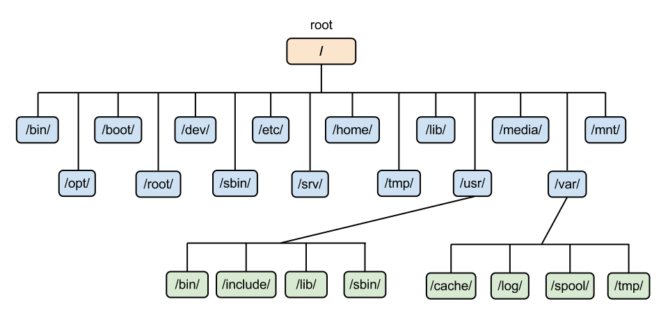

## Important definitions and notes
- The terms <u>folder</u> and <u>directory</u> are often used interchangeably. 
  In Linux and Unix, directory is the technically correct term, while folder is more common in graphical interfaces.
- Linux often exposes system resources through file-like interfaces. 
  Actual files, devices, and inter-process communication endpoints are commonly represented as files.
- `superuser` is a user account with <u>unrestricted administrative privileges</u> on the system
- `root` is the <u>default administrative/superuser account</u>.
- Mounting is the process of attaching a *filesystem* to a *directory* so its contents become accessible from that directory. 
- The `directory` used for mounting is called a <u>mount point</u>. 
- A `filesystem` is the method and structure used by the operating system to organize, store, and retrieve files and directories on a storage device.
- A `symbolic link` or `symlink` is a special type of file that <u>points to another file or directory</u>.

## Filesystems
A filesystem defines the structure, rules, and methods of how data is organized, stored, accessed and managed on a storage device.

It is the role of the filesystem to define rules and methods for different tasks such as
 naming a file, maintaining metadata, providing utilities, maintain journal logs, and many others.

There are many filesystems that may be used. The most used ones are:

### EXT
EXT stands for Extended FileSystem. It was released in 1992. It was the first filesystem created specifically for Linux.

Later on, EXT 2 was released in 1993, EXT3 was released in 1999, EXT4 was released in 2006. 

EXT4 is the latest filesystem of the EXT family.

It supports journaling, large files, persistent pre-allocation, and unlimited subdirectories.

### XFS
XFS is a 64-bit journaling filesystem ported to linux in 2001.

It supports journaling, sparse files, parallel I/O operations, and very large storage capacities.

It is excellent for parallel I/O operations and is used by default in many Linux distributions.

### BTRFS
BTRFS was introduced in 2007.

It supports snapshots, drive pooling, data scrubbing, self-healing, online defragmentation, and advanced storage management.

### Others
Other filesystems such as NTFS and exFAT are also supported primarily for cross-platform data exchange.

## FileSystem Hierarchy

At the top is `/` directory. This directory is called the `root` directory, as it is the root of the filesystem.  
Its subdirectories and their functions are:

### Essential system directories
#### `/boot`
It contains the files required while booting, such as bootloader files, kernel images, etc

#### `/bin`
`/bin` contains commands that may be used by both the system administrator and by users, 
but which are required when no other filesystems are mounted (e.g. in single user mode). 

#### `/sbin`
`/sbin` contains binaries essential for booting, restoring, recovering, and/or repairing the system in addition to the binaries in `/bin`.

#### `/lib`
The `/lib` directory contains those shared library images needed to boot the system and run the commands in the root filesystem,
ie, by binaries in `/bin` and `/sbin`.

#### `/lib<qual>`
There may be one or more variants of the `/lib` directory on systems which support more than one binary format requiring separate libraries.

#### `/etc`
It contains various configuration files for the system.

### User and application directories
#### `/home`
It contains personal files and directories of the user accounts registered on the system. 

In my case, my files and directories are stored under `/home/vyankateshd`.

#### `/root`
This is the `/home/vyankateshd` directory equivalent of the `root` user. The `root` user is a special user which has all the permissions.

#### `/opt`
This is another directory for applications. 
These generally include third party software 
or applications installed separately from the system package manager
or applications that do not follow the standard directory structure used by the distribution.

#### `/usr`
`/usr` is the second major section of the filesystem. `/usr` is shareable, read-only data. 
That means that `/usr` should be shareable between various FHS-compliant hosts and must not be written to. 
Any information that is host-specific or varies with time is stored elsewhere.

##### `/usr/bin`
This is the primary directory of executable commands on the system.

##### `/usr/sbin`
This directory contains any non-essential binaries used exclusively by the system administrator.

##### `/usr/lib`
`/usr/lib` includes object files and libraries. On some systems, it may also include internal binaries that
are not intended to be executed directly by users or shell scripts.

##### `/usr/local`
The `/usr/local` hierarchy is for use by the system administrator when installing software locally. 
It may be used for programs and data that are shareable amongst a group of hosts, but not found in `/usr`.

Locally installed software must be placed within `/usr/local` rather than `/usr` 
unless it is being installed to replace or upgrade software in `/usr`.

##### `/usr/include`
This is where all of the system's general-use include files for the C programming language should be placed.

#### `/srv`
This directory contains data served by system services such as web servers or FTP servers.

### Virtual directories
#### `/dev` and `/sys`
These are virtual directories, meaning they are not physically present on disk. 
Both of these deal with devices connected to the system. 

`/dev` enables applications to do operations on the devices such as input and output.

`/sys` exposes the configurations of the devices themselves, such as brightness of a monitor.

#### `/proc`
This is another virtual directory like `/dev`. 

This directory lists and exposes information about the processes running on the system, and that of the kernel itself.

Each running process has a subdirectory named after its process ID or PID for short.

### Temporary and runtime data
#### `/run`
This directory stores runtime data created after boot. This may include system information, application information, user information.

#### `/tmp`
This directory is meant to contain temporary files generated during system updates, or files generated 
by applications which are only temporarily required. 

You can store your own temporary files in here as well.

#### `/var`
This directory is used to store variable data such as logs, caches, and spool files.

### Storage device directories
#### `/media`
This directory lists automatically mounted temporary storage devices connected to the system. If you connect a pendrive, it will show up here.

#### `/mnt`
This directory is used to manually mount storage devices.

 

Modern Linux distributions often create symbolic links at `/bin`, `/sbin`, and `/lib` pointing at `/usr/bin`, `/usr/sbin`, `/usr/lib` respectively.
The main reason for this separation is that in the time of Unix, the storage devices were small. 
All the binaries could not be loaded on a single storage device. 

Hence, `/sbin`, `/bin`, and `/lib` were updated to contain binaries necessary for booting,
and all other binaries were moved to `/usr` equivalents of the same.
As such, they were loaded on different storage devices, which were mounted at specified locations. 

As storage limits have improved drastically, the separation of these directories does not make sense or matter as much.